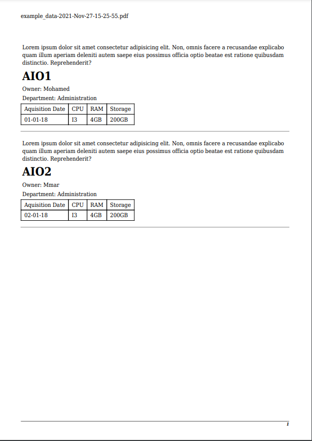

# SHEET2PDF
This is a command line tool that reads rows of data from **CSV**, **XLSX** or **ODS** spreadsheet files and generates **PDF** files with data cards for each row.

## System requirements

1. Having **PHP** installed on your system.
2. Enabling the `gd` and `mbstring` **PHP extensions** ([**mPDF** library](https://mpdf.github.io/about-mpdf/requirements-v7.html) dependancies).
3. Having **Composer** installed on your system if you want to clone the project instead of using the releases.

## Setup
Run:
```text
git clone https://github.com/medilies/sheet2pdf
```

```text
cd ./sheet2pdf
```

```text
composer install
```

## TUTORIAL

### Overview

In the following example we have a spreadsheet `example_data.csv` which contains computers inventory.

We need to create and print little cards to stick them in the back of each computer.

The **CSV** looks like:

  | id  | computer_name | owner    | location_department | aquisition_date | cpu    | ram   | disk_size |
  | --- | ------------- | -------- | ------------------- | --------------- | ------ | ----- | --------- |
  | 1   | AIO1          | Mohamed  | Administration      | 01-01-18        | I3     | 4GB   | 200GB     |
  | 2   | AIO2          | Omar     | Administration      | 02-01-18        | I3     | 4GB   | 200GB |
  | 3   | AIO3          | Othman   | Administration      | 03-01-18        | I3     | 4GB   | 200GB     |
  | 4   | AIO4          | Abubakar | Administration      | 04-01-18        | I3     | 4GB   | 200GB     |
  | 5   | AIO5          | Nadir    | Communication       | 05-01-18        | I3     | 4GB   | 200GB     |
  | 6   | Laptop1       | Sofiane  | Finance             | 05-06-20        | I3     | 4GB   | 200GB     |
  | 7   | Laptop2       | Ilies    | IT                  | 06-06-20        | Ryzen5 | 16GB  | 1TB       |
  | 8   | Laptop3       | Islam    | IT                  | 07-06-20        | Ryzen5 | 16GB  | 1TB       |
  | 9   | SERVER        | none     | IT                  | 01-01-21        | Xeon   | 128GB | 64TB      |

### Results preview

The generated **PDF** will look like:

<div align="center">
    
</div>

### Usage steps

1. We must have  an **HTML** file which will serve as a template for generating the PDF cards. The **HTML** code must contain only the `<body>` tags.
2. We need to map the columns from the **CSV** to the **HTML template** using the following special syntax `%VAR_column_name%`.
> For example the `computer_name` column from the **CSV** will be refenced as `%VAR_computer_name%` in the **HTML template**.
3. We can use **CSS** to style the template (The stylesheet name **MUST** match the HTML file name).
4. We execute the CLI command with the path of the mentionned files.

### Executing the steps

Our template will be named `example.html` and will look like:

```html
<p>
    Lorem ipsum dolor sit amet consectetur adipisicing elit. Non, omnis
    facere a recusandae explicabo quam illum aperiam deleniti autem saepe
    eius possimus officia optio beatae est ratione quibu sdam distinctio.
    Reprehenderit?
</p>
<h1>%VAR_computer_name%</h1>
<p>Owner: %VAR_owner%</p>
<p>Department: %VAR_location_department%</p>
<table>
    <tr>
        <td>Aquisition Date</td>
        <td>CPU</td>
        <td>RAM</td>
        <td>Storage</td>
    </tr>
    <tr>
        <td>%VAR_aquisition_date%</td>
        <td>%VAR_cpu%</td>
        <td>%VAR_ram%</td>
        <td>%VAR_disk_size%</td>
    </tr>
</table>
<hr />
```

We will add a **CSS** file named `example.css` next the `example.html` to give `borders`, `padding` and `margin` to the table cells.
```css
table,
th,
td {
    border: 1px solid black;
    border-collapse: collapse;
}

td {
    padding: 4px 8px;
}

hr {
    margin: 16px 0;
}
```

Finally, knowing that all the mentionned files are in the same directory, generate the **PDF** with:

```text
php .\sheet2pdf.php .\example\example_data.csv .\example\example.html 2
```

Cammand explanation

- A **-o** option is omitted, so the PDF will be outputed next the **CSV** file, otherwise the **PDF** will be outputed in the specified location.
- The first argument **.\example\example_data.csv** is the relative path to the data source.
- The second argument **.\example\example.html** is the relative path to the template.
- The third argument **2** tells the program to generate a maximum of two cards per page.

## NOTE

1. Knowing the library **mPDF** can help you customize the source code of this project to suit you better.
2. You may find that the **mPDF** library is limited when it comes to trasnlating crazy styled HTML and it is the case with other alternative PHP libraries (**Fpdf**, **DOMpdf** ...), for example you cannot output PDFs with _flex_ or _grid_ display.

## BUGS

-   ~~One white space is being prepended the first key of the CSV when parsing it!~~
    > Fixed by using the **PhpSpreadsheet** library instead of [the custom CSV parser](https://github.com/medilies/sheet2pdf/commit/536978593a4fa6ec28b265f0c19526a7363021ec#diff-9aaba009e17d6fe971f53cd683e9e617e9bcbf94d7e053ed0d60480d27c2d7baL73)

## TODO

-   Extend the `%VAR_%` feature. For exmaple:
    -   `%UPPER_str%` will apply `strtoupper()` on `str`.
    -   `%DATE_date:FORMAT%` will allow formating date.
-   Use the **mikehaertl/phpwkhtmltopdf** library instead of **mPDF**
    > Testing: Till now didn't see too much improvment comparing to **mpPDF**
-   Try PDF templates instead of HTML templates
